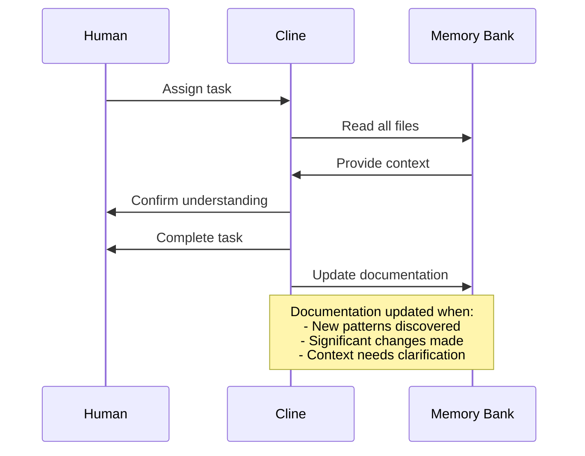

# Product Context

## Purpose
The Memory Bank exists to solve the unique challenge of complete memory resets between sessions. It serves as a comprehensive knowledge repository that allows Cline to maintain continuity and effectiveness despite these resets.

## Problems Solved
1. **Knowledge Continuity**: Eliminates the need to re-explain project details after each reset
2. **Context Preservation**: Maintains a record of decisions, rationales, and project evolution
3. **Independent Operation**: Enables Cline to work effectively with minimal supervision
4. **Documentation Discipline**: Enforces rigorous documentation practices that benefit the entire project

## Intended Operation
The Memory Bank operates as a hierarchical documentation system:

1. Cline reads all Memory Bank files at the start of each session
2. Documentation is updated throughout the development process
3. Critical insights and patterns are captured in the `.clinerules` file
4. The system evolves to accommodate new project complexities

## User Experience Goals
For the human collaborator:
- Reduced need to repeat explanations or context
- Confidence that Cline understands the project state
- Ability to continue work seamlessly between sessions
- Clear visibility into Cline's understanding of the project

For Cline:
- Complete, accessible project context after each reset
- Clear guidance on current priorities and next steps
- Understanding of project patterns and preferences
- Framework for capturing and utilizing project intelligence

## Interaction Model

## Success Indicators
- Cline can immediately resume work after resets
- Human collaborator spends less time explaining context
- Project documentation remains current and comprehensive
- Development velocity remains consistent despite resets
