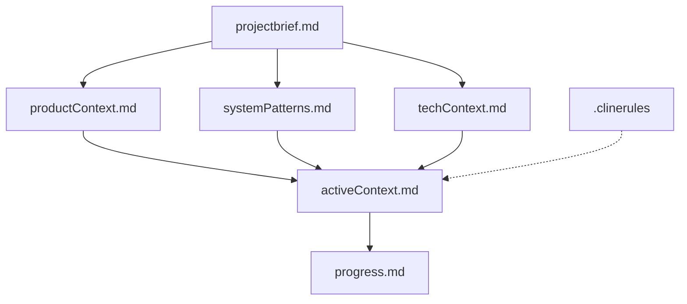
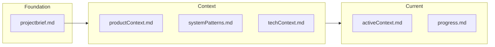

# System Patterns

## Architecture Overview
The Memory Bank follows a hierarchical documentation architecture with clear dependencies between components. The system is designed to be both comprehensive and navigable, allowing for quick context retrieval.

## Key Technical Decisions

### Markdown-Based Documentation
- **Decision**: Use Markdown for all documentation files
- **Rationale**: Markdown provides a balance of readability, structure, and simplicity
- **Benefit**: Files can be easily viewed, edited, and version-controlled

### Hierarchical Structure
- **Decision**: Organize documentation in a clear hierarchy with defined dependencies
- **Rationale**: Creates a logical reading order and clear update patterns
- **Benefit**: Ensures comprehensive context without redundancy

### Separate Intelligence Capture
- **Decision**: Maintain `.clinerules` as a separate learning journal
- **Rationale**: Distinguishes factual documentation from learned patterns and preferences
- **Benefit**: Allows for flexible capture of project intelligence that doesn't fit elsewhere

## Design Patterns

### Single Source of Truth
Each aspect of the project has one definitive location in the documentation:
- Project scope and goals → `projectbrief.md`
- Product context and purpose → `productContext.md`
- Current focus and recent changes → `activeContext.md`
- Technical implementation → `techContext.md`
- System design and patterns → `systemPatterns.md`
- Progress and status → `progress.md`

### Progressive Disclosure
Documentation follows a pattern of progressive disclosure:
1. Start with high-level overview (projectbrief)
2. Move to more specific context (product, system, tech)
3. Focus on current state (activeContext)
4. End with detailed progress tracking

### Continuous Documentation
Documentation updates are integrated into the development workflow:
- Updates occur alongside code changes
- Documentation is treated as a first-class artifact
- Changes to the system trigger documentation reviews

## Component Relationships

### Core Files Interaction

### Update Patterns
- `projectbrief.md`: Updated when project scope or goals change
- `productContext.md`: Updated when product purpose or user experience goals evolve
- `systemPatterns.md`: Updated when architectural decisions or patterns change
- `techContext.md`: Updated when technologies or technical constraints change
- `activeContext.md`: Updated frequently to reflect current focus
- `progress.md`: Updated after significant milestones or changes to project status
- `.clinerules`: Updated continuously as new patterns are discovered

## Extension Mechanism
The Memory Bank can be extended with additional context files when needed:
- Feature-specific documentation
- API specifications
- Integration details
- Testing strategies
- Deployment procedures

These extensions maintain the same principles of clarity, hierarchy, and single source of truth.
